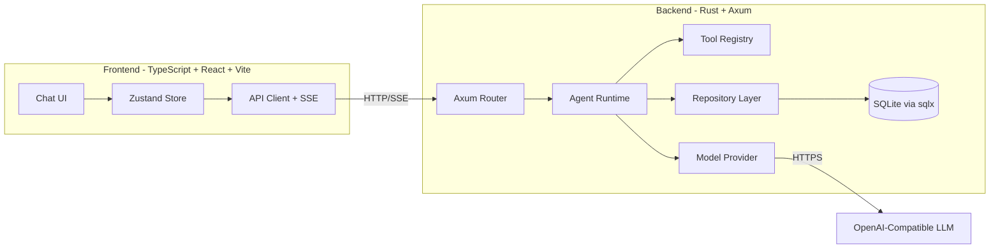
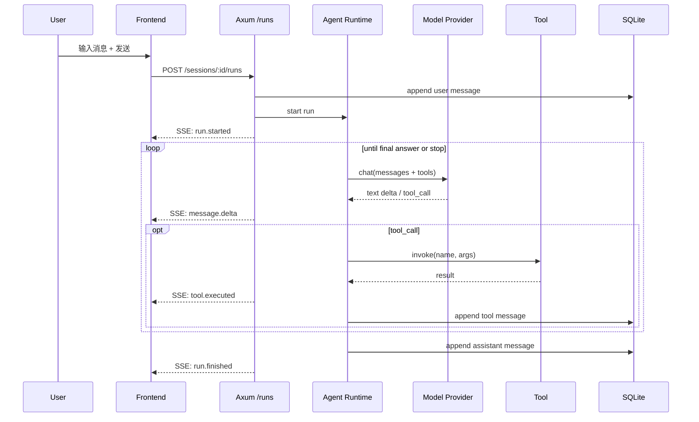

# 计划：轻量级通用 Agent 平台

> 本文件定义 "如何构建" [`spec.md`](./spec.md) 中描述的产品。配套任务分解见 [`tasks.md`](./tasks.md)。

---

## 1. 总体架构



**关键设计原则**：
1. 后端是唯一可信的 Agent 执行方；前端只负责展示。
2. 工具以 Rust trait 抽象，启动时通过 inventory / 显式注册注入。
3. 模型提供方以 `async_trait` 抽象，便于 Mock。
4. 持久化集中在 Repository 层，业务不直接接触 SQL。

---

## 2. 技术栈

| 层 | 选型 | 说明 |
|----|------|------|
| 后端语言 | **Rust 1.78+ (edition 2021)** | 类型安全 + 高性能 |
| 异步运行时 | `tokio` (full features) | |
| Web 框架 | `axum 0.7` + `tower` + `tower-http` | 生态成熟，SSE 友好 |
| 数据库 | `sqlx 0.7` (SQLite) | 编译期 SQL 校验；本地零配置 |
| 序列化 | `serde` + `serde_json` | |
| 配置 | `dotenvy` + `figment` (或简易 `envy`) | 12-factor |
| 日志 | `tracing` + `tracing-subscriber` | 结构化日志 |
| 错误处理 | `thiserror` + `anyhow` | 领域错误 vs 通用错误 |
| 测试 | 单元测试 + `cargo test` + `wiremock` (HTTP mock) | |
| 前端语言 | **TypeScript 5.x** | |
| 前端构建 | **Vite 5** | 极快冷启动 |
| UI 框架 | **React 18** | |
| 路由 | `react-router-dom 6` | |
| 状态管理 | `zustand` | 轻量 |
| 样式 | **Tailwind CSS 3** | 与 design system 配合 |
| HTTP | 原生 `fetch` + 自封装 `apiClient` | 不引入 axios |
| 包管理 | **pnpm** | 体积小、速度快 |
| Lint/Format | ESLint + Prettier | |
| 共享类型 | `shared/` 目录，TypeScript 类型 + 文档 | 单一来源（前端直接消费） |

---

## 3. 仓库结构

```text
.
├── .trae/
│   ├── documents/
│   │   ├── spec.md
│   │   ├── plan.md
│   │   ├── tasks.md
│   │   ├── prd.md
│   │   └── technical-architecture.md
│   └── rules/
│       └── project_rules.md
├── backend/                      # Rust crate
│   ├── Cargo.toml
│   ├── .env.example
│   ├── migrations/               # SQL 迁移（时间戳前缀）
│   ├── src/
│   │   ├── main.rs               # 入口、启动 axum
│   │   ├── config.rs             # 配置加载
│   │   ├── error.rs              # 统一错误类型
│   │   ├── state.rs              # AppState
│   │   ├── db.rs                 # sqlx pool 初始化
│   │   ├── routes/
│   │   │   ├── mod.rs
│   │   │   ├── health.rs
│   │   │   ├── sessions.rs
│   │   │   ├── messages.rs
│   │   │   ├── runs.rs
│   │   │   └── tools.rs
│   │   ├── agent/
│   │   │   ├── mod.rs
│   │   │   ├── runtime.rs        # 主循环：think -> tool -> think
│   │   │   ├── message.rs        # 消息类型
│   │   │   └── tool.rs           # Tool trait
│   │   ├── tools/                # 内置工具
│   │   │   ├── mod.rs
│   │   │   ├── echo.rs
│   │   │   ├── time.rs
│   │   │   └── http_get.rs
│   │   ├── model/
│   │   │   ├── mod.rs
│   │   │   ├── provider.rs       # ModelProvider trait
│   │   │   ├── openai.rs         # OpenAI 兼容实现
│   │   │   └── mock.rs           # 离线 Mock
│   │   └── repo/                 # Repository
│   │       ├── mod.rs
│   │       ├── session.rs
│   │       └── message.rs
│   └── tests/
├── frontend/                     # TypeScript + Vite + React
│   ├── package.json
│   ├── tsconfig.json
│   ├── tsconfig.node.json
│   ├── vite.config.ts
│   ├── tailwind.config.js
│   ├── postcss.config.js
│   ├── index.html
│   ├── .env.example
│   └── src/
│       ├── main.tsx
│       ├── App.tsx
│       ├── router.tsx
│       ├── pages/
│       │   ├── HomePage.tsx      # 聊天主界面
│       │   └── NotFoundPage.tsx
│       ├── components/
│       │   ├── Sidebar.tsx
│       │   ├── ChatPanel.tsx
│       │   ├── MessageBubble.tsx
│       │   ├── ToolCallCard.tsx
│       │   ├── Composer.tsx
│       │   └── EmptyState.tsx
│       ├── hooks/
│       │   ├── useSessions.ts
│       │   └── useRunStream.ts
│       ├── store/
│       │   └── chatStore.ts      # zustand
│       ├── api/
│       │   ├── client.ts
│       │   ├── sessions.ts
│       │   ├── messages.ts
│       │   ├── runs.ts
│       │   └── tools.ts
│       ├── lib/
│       │   └── sse.ts            # SSE 解析工具
│       └── styles/
│           └── globals.css
├── shared/                       # 前后端共享类型
│   └── types.ts                  # Session / Message / Run / Tool 等 DTO
├── README.md
├── .gitignore
└── .editorconfig
```

---

## 4. 数据流：一次 Run 的生命周期



---

## 5. SSE 事件协议

`Content-Type: text/event-stream`，每条事件形如：

```
event: message.delta
data: {"delta":"你好"}

event: tool.call
data: {"id":"call_1","name":"get_current_time","arguments":{}}

event: tool.result
data: {"id":"call_1","output":"2026-06-15 10:00:00"}

event: run.finished
data: {"run_id":"...","status":"ok"}
```

事件类型：`run.started` / `message.delta` / `message.final` / `tool.call` / `tool.result` / `error` / `run.finished`。

---

## 6. 安全与配置

- 所有密钥、BaseURL、模型名均通过 `.env` 注入；仓库仅提供 `.env.example`。
- CORS：开发态允许 `http://localhost:5173`；生产态通过 `CORS_ALLOW_ORIGIN` 配置。
- 工具执行默认超时 10 秒，可由工具自身声明。
- 模型调用失败统一转为 502 错误给前端。

---

## 7. 测试策略

| 层 | 范围 | 工具 |
|----|------|------|
| Rust 单元 | Tool 实现、消息组装、错误映射 | `#[cfg(test)]` |
| Rust 集成 | Router 端点、Agent 循环（使用 Mock Provider） | `axum::Router` + `tower::ServiceExt` |
| TS 单元 | SSE 解析、Store reducer | Vitest |
| TS 组件 | MessageBubble、Composer | Vitest + RTL |
| 端到端 | 创建会话 → 触发 Run → 渲染 | 暂不引入 Playwright（v1.0 手动验证） |

---

## 8. 部署（v1.0 范围外但留好接口）

- 后端：单二进制 `agent-backend`，监听 `0.0.0.0:8080`
- 前端：`pnpm build` 产物通过 Nginx 静态托管，反代 `/api` 到后端
- 数据库：单文件 `data/agent.db`

---

## 9. 风险与对策

| 风险 | 对策 |
|------|------|
| LLM 工具调用协议不一致 | 抽象 `ModelProvider`，将 OpenAI 协议封进独立模块 |
| SSE 在某些代理下不工作 | 文档中明确建议关闭代理缓冲；提供 `disable_buffer` 配置 |
| SQL 迁移随时间膨胀 | 每次迁移文件名带时间戳，禁用修改历史迁移 |
| 前端长会话性能 | 消息列表虚拟化（v1.1） |

---

## 10. 里程碑

1. **M1 - 骨架**（本次任务）：目录结构 + 文档 + 后端可启动 + 前端可启动
2. **M2 - 持久化**：Session / Message CRUD + SQLite
3. **M3 - Agent 内核**：Runtime + Mock Provider + 工具调用闭环
4. **M4 - 流式 UI**：SSE + 前端打字机效果
5. **M5 - 真实模型**：OpenAI 兼容 Provider + 配置文档
6. **M6 - 打磨**：错误态、空态、停止、虚拟化
