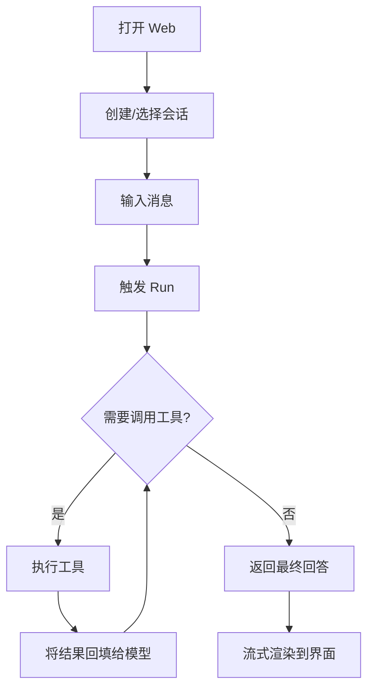

# PRD：轻量级通用 Agent 平台

> 详细规范见 [`spec.md`](./spec.md)，技术方案见 [`plan.md`](./plan.md)。

## 1. 产品概述

一个 **轻量级、可扩展的通用 Agent 平台**：用户通过 Web 界面与 Agent 进行多轮对话，Agent 可自动调用工具完成任务。
目标用户为个人开发者 / 小团队，强调 **本地零配置启动** 与 **易扩展**。

## 2. 核心功能

| 模块 | 页面/接口 | 功能 |
|------|----------|------|
| 会话 | 会话列表 + 对话区 | 新建/重命名/删除会话、消息流式渲染、工具调用可视化 |
| Agent | - | 系统提示词 + 工具集合 + 流式推理循环 |
| 工具 | `/api/tools` | 内置 echo / get_current_time / http_get；用户可扩展 |
| 模型 | - | OpenAI 兼容协议；离线 Mock 兜底 |

## 3. 核心流程

## 4. 界面设计

### 4.1 设计风格

- **主色**：中性灰 `zinc-50/100/900` 为主背景，强调色用 **emerald-500**（绿色，象征"激活/可用"）
- **按钮**：轻量圆角 `rounded-md`，无 3D 阴影；hover 用 `bg-*` 微调
- **字体**：`Inter` 文本 + `JetBrains Mono` 代码块
- **布局**：左 280px 会话列表 + 右自适应对话区
- **图标**：`lucide-react`

### 4.2 页面设计概览

| 页面 | 模块 | UI 元素 |
|------|------|---------|
| HomePage | 顶栏 | 标题、新建会话按钮、设置入口（占位） |
| HomePage | Sidebar | 会话列表、当前选中高亮、hover 删除 |
| HomePage | ChatPanel | 消息气泡（用户/助手/工具）、停止按钮 |
| HomePage | Composer | 多行输入、Enter 发送、Shift+Enter 换行 |
| HomePage | EmptyState | 居中欢迎语 + 提示操作 |

### 4.3 响应式

- 桌面优先（>= 1024px）
- 平板（>= 768px）侧边栏可折叠
- 移动端（< 768px）侧边栏抽屉化

## 5. 验收标准

- 与 `spec.md §8` 一致
