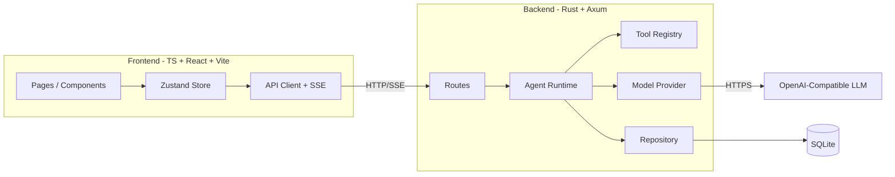
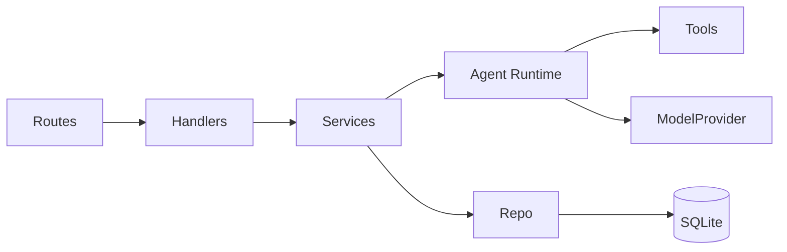
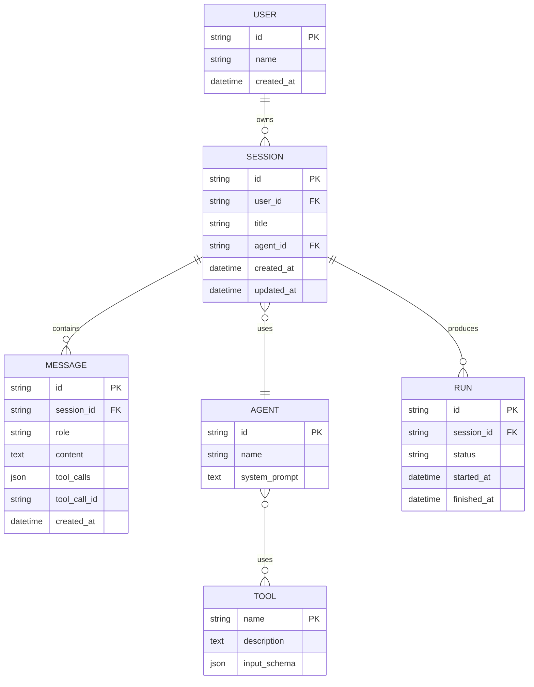

# 技术架构：轻量级通用 Agent 平台

> 详细规范见 [`spec.md`](./spec.md)，实施计划见 [`plan.md`](./plan.md)。

## 1. 架构设计



## 2. 技术栈

- **Frontend**: Vite 5 + React 18 + TypeScript 5 + Tailwind CSS 3 + Zustand + react-router-dom 6
- **Backend**: Rust 1.78+ (edition 2021) + axum 0.7 + tokio + sqlx (SQLite) + serde + tracing
- **共享层**: `shared/types.ts`（前端直接消费，文档化后端 DTO 字段）
- **包管理**: pnpm（前端）、Cargo（后端）
- **测试**: Vitest + React Testing Library（前端）；`cargo test` + `tower::ServiceExt`（后端）

## 3. 路由定义

| 路径 | 用途 |
|------|------|
| `/` | 聊天主页（含侧边栏） |
| `/sessions/:id` | 跳转到对应会话 |

## 4. API 定义（TypeScript 类型草案）

```ts
// shared/types.ts
export type Role = "system" | "user" | "assistant" | "tool";

export interface ToolDef {
  name: string;
  description: string;
  input_schema: Record<string, unknown>;
}

export interface Session {
  id: string;
  title: string;
  agent_id: string;
  created_at: string;
  updated_at: string;
}

export interface Message {
  id: string;
  session_id: string;
  role: Role;
  content: string;
  tool_calls?: ToolCall[];
  tool_call_id?: string;
  created_at: string;
}

export interface ToolCall {
  id: string;
  name: string;
  arguments: Record<string, unknown>;
}

export interface CreateSessionReq {
  title?: string;
  agent_id?: string;
}

export interface CreateRunReq {
  user_message: string;
}

// SSE 事件
export type RunEvent =
  | { type: "run.started"; run_id: string }
  | { type: "message.delta"; delta: string }
  | { type: "message.final"; message: Message }
  | { type: "tool.call"; call: ToolCall }
  | { type: "tool.result"; call_id: string; output: string }
  | { type: "error"; code: string; message: string }
  | { type: "run.finished"; run_id: string; status: "ok" | "stopped" | "error" };
```

## 5. 服务端架构



层级：

- `routes/`：HTTP 边界，参数解析、状态码映射
- `services/`：业务用例（本项目暂不单列，逻辑放 handlers）
- `agent/`：核心循环
- `model/`：LLM 抽象与实现
- `tools/`：工具实现
- `repo/`：数据访问

## 6. 数据模型



## 7. DDL 草案（v1.0）

```sql
CREATE TABLE IF NOT EXISTS users (
  id TEXT PRIMARY KEY,
  name TEXT NOT NULL,
  created_at TEXT NOT NULL DEFAULT (datetime('now'))
);

CREATE TABLE IF NOT EXISTS agents (
  id TEXT PRIMARY KEY,
  name TEXT NOT NULL,
  system_prompt TEXT NOT NULL DEFAULT ''
);

CREATE TABLE IF NOT EXISTS sessions (
  id TEXT PRIMARY KEY,
  user_id TEXT NOT NULL,
  title TEXT NOT NULL,
  agent_id TEXT NOT NULL,
  created_at TEXT NOT NULL DEFAULT (datetime('now')),
  updated_at TEXT NOT NULL DEFAULT (datetime('now')),
  FOREIGN KEY (user_id) REFERENCES users(id),
  FOREIGN KEY (agent_id) REFERENCES agents(id)
);

CREATE TABLE IF NOT EXISTS messages (
  id TEXT PRIMARY KEY,
  session_id TEXT NOT NULL,
  role TEXT NOT NULL,
  content TEXT NOT NULL,
  tool_calls TEXT,
  tool_call_id TEXT,
  created_at TEXT NOT NULL DEFAULT (datetime('now')),
  FOREIGN KEY (session_id) REFERENCES sessions(id)
);

CREATE INDEX IF NOT EXISTS idx_messages_session ON messages(session_id, created_at);
CREATE INDEX IF NOT EXISTS idx_sessions_user ON sessions(user_id, updated_at DESC);
```

## 8. 配置（环境变量）

| 变量 | 必填 | 说明 |
|------|------|------|
| `DATABASE_URL` | 否 | 默认 `sqlite://data/agent.db` |
| `BIND_ADDR` | 否 | 默认 `0.0.0.0:8080` |
| `CORS_ALLOW_ORIGIN` | 否 | 默认 `http://localhost:5173` |
| `OPENAI_API_KEY` | 否 | 不配置则使用 Mock |
| `OPENAI_BASE_URL` | 否 | 默认 `https://api.openai.com/v1` |
| `OPENAI_MODEL` | 否 | 默认 `gpt-4o-mini` |
| `RUST_LOG` | 否 | 默认 `info` |
